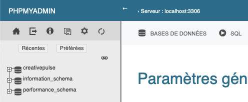

# Mise en place de notre site web sur le serveur Pingouin

Voici la marche à suivre pour faire en sorte que notre site web ait fonctionné sur \
[creativepulse-pingouin.heig-vd.ch](creativepulse-pingouin.heig-vd.ch), nous avons écris cette marche à suivre de manière neutre, comme si c'était un tutoriel.

Nous limitons les détails et les grands paragraphes après le chapitre "Insertion de la BD" car nous sommes conscients que si vous lisez ceci, vous comprenez généralement ce qu'il faut faire.

## Export de notre BD de développement

Notre base de donnée de développement est déjà une bonne base pour utiliser notre site web. Si vous souhaitez posséder "rapidement" une base de donnée pour essayer, voici le script SQL, pour que vous essayez.

Afin d'être plus efficace pour la mise en place, vous pouvez déjà copier dans le presse papier de votre ordinateur les lignes présentent dans le fichier .sql qui vous est fourni sur Teams.

Si vous avez des seeders, vous n'avez pas l'oligation de copier le code ci-dessous.

## Insertion de la DB

### En copiant collant le SQL

Connectez-vous sur `nomDuGroupe-pingouin.heig-vd.ch/phpmyadmin` dans le cadre d'une base de donnée MySQL (ce qui a été notre choix).

Saisissez le nom d'utilisateur ainsi que le mot de passe correspondant qui vous est fourni par votre administrateur.

Créez une nouvelle table que vous nommerez ou accédez directement à la table puis aller sur l'onglet _"SQL"_ puis collez le code copié précédemment et éxecutez ce dernier, ce que vous voyez à l'écran peut être différent de cette image en raison du thème par défaut _"pmahomme"_ sur phpmyadmin et ici nous avons le thème _"Metro"_.



Félicitations, vous avez peuplé la base de données!

### Avec des commandes PHP artisan

Continuer votre lecture, nous mettrons en temps voulu le bon moment pour faire ceci.

## Télécharger le repo Git depuis github directement sur le serveur

Connectez-vous sur pingouin.heig-vd.ch avec le terminal puis avec le mot de passe de l'école. N'oubliez pas que cela fonctionne uniquement si vous êtes connecté au réseau de l'école ou depuis le dernier VPN recommandé par le helpdesk.

```
ssh login.aai@pingouin.heig-vd.ch
```

`exemple : ssh patrick.marquesm@pingouin.heig-vd.ch`

Allez sur votre répértoire projart (en changeant les 20XX pour l'année et les Y pour votre volée et les Z pour le nom de votre groupe)
(dans notre cas)

```
cd ../projart/20XX/YY/ZZZ
```

`exemple : cd ../projart/2023/50/creativepulse`

Pour notre part, nous avons effacé le dossier `nomDuGroupe-laravel`.

Ensuite on fait un `git clone` du dépôt Git pour récupérer les fichiers du site web

```
git clone <URL_du_repo>
```

Une fois le clonage terminé, renommez-le (cela va effacer le dossier de base et vous évites donc de faire une suppression avant).

```
mv nomDuDossierCloné <nomDuGroupe>-laravel
```

Puis allez dans le dossier

```
cd <nomDuGroupe>-laravel
```

Copiez le fichier d'exemple `.example.env` pour créer le fichier `.env` (à moins que vous ayez laissé le .env sur le repo Git ou que vous voulez faire un _Drag & Drop_ sur l'application FileZilla par exemple)

```
cp .example.env .env
```

Modifiez le fichier `.env` (en ligne de commande avec `nano` ou `vim` par exemple, ou depuis un éditeur de texte) selon les paramètres spécifiques à votre configuration, tels que la base de données, les identifiants, la APP_KEY (que vous pouvez générer via `php artisan key:generate`), pusher si vous avez pusher, votre service mail.

Si vous avez pris le fichier `.env` depuis votre projet, partez du principe que vous devez modifier uniquement le nom de la base de donnée si vous n'avez pas pu la choisir, le port, l'utilisateur, le mot de passe.

De ce que nous avons observé, le site est tout autant fonctionnel si vous ne modifiez pas la ligne `APP_URL`.

Une fois en production, vérifiez que la ligne `APP_DEBUG` soit égal à `false`, ceci permettra d'éviter d'afficher les potentielles erreurs aux visiteurs de votre site web, pour faire simple, ils ne verront pas la page au lieu d'atterrir sur la page qui explique l'erreur précise sur le site web et ainsi dévoiler des potentielles informations confidentielles.

De plus, si vous en avez la possibilité (pas à notre connaissance sur pingouin), améliorez encore plus votre sécurité en mettant des variables d'environnement dans le serveur et dans le fichier `.env`.

## Exécution des commandes présentes dans le fichier word fourni par le professeur

Executez depuis votre répértoire toutes les commandes ci-dessous (toujours en changeant le 20XX pour l'année et les Y pour votre volée et les Z pour le nom de votre groupe). Ils permettront de changer les droits de lecture et d'écriture.

```
sudo chgrp -R ZZZ /home/projart/20XX/YY/ZZZ/

sudo chown -R www-data /home/projart/20XX/YY/ZZZ/ZZZ-laravel/storage/

sudo chown -R www-data /home/projart/20XX/YY/ZZZ/ZZZ-laravel/bootstrap/cache/

sudo chmod -R g+wrX /home/projart/20XX/YY/ZZZ/ZZZ-laravel/

sudo chmod -R g+wrX /home/projart/20XX/YY/ZZZ/ZZZ-apache.conf
```

## Exécution des commandes recommandées par le site Laravel

Executez toutes ces commandes qui sont recommandées sur le site de Laravel, (nous les avons toutes utilisées, même la commande qui concerne les Event car nous avons des Event).

Dernière consultation le 15.06.23 sur le site de [laravel](https://laravel.com/docs/10.x/deployment#main-content).

```
composer install --optimize-autoloader --no-dev

php artisan config:cache

php artisan event:cache

php artisan route:cache

php artisan view:cache
```

## Autre commandes

Il n'est pas impossible que vous deviez faire d'autres commandes comme par exemple `php artisan storage:link` ou `npm install`, en fonction des besoins de votre site.

C'est à cet instant que les personnes qui voulaient installer leur base de donnése remplie avec des seeders en ligne de commande qu'ils peuvent le faire, vous avez normalement à faire uniquement `php artisan migrate` (si vous avez une erreur, faite `php artisan migrate:install` juste avant), puis `php artisan db:seed`.

## Génération des fichiers optimisés et vérification du bon fonctionnement

Exécutez la commande suivante pour générer les fichiers optimisés du site web.

```
npm run build
```

Vérifiez que tout fonctionne correctement en accédant à `nomDuGroupe-pingouin.heig-vd.ch` dans votre navigateur.

Si tout est opérationnel, félicitations !

Votre site web est maintenant déployé sur le serveur Pingouin.

Si vous voulez tester notre site web en tant qu'administrateur, utilisez l'accès suivant.

Username : Admin
MDP : Admin

## Mises à jour

À chaque fois que vous modifiez votre répertoire original et que vos modifications sont enregistrées sur GitHub, pensez à faire 3 choses, même si c'est redondant.

Faite au minimum, `git pull` et puis `npm run build`.

Pensez également s'il y a un problème de cache ou de route suite à vos modifications à faire un `php artisan cache:clear` et `php artisan route:cache`;

# Problèmes ?

Votre site web ne fonctionne ou est comme vous voulez que si vous faite un npm run dev en parallèle ? Il n'est donc pas prêt au déploiement.
Cela peut être dû à une utilisation multiple de l'instruction @vite par exemple (si vous utilisez `vite`).
Faites les diverses modifications et retentez de faire `npm run build` et de voir le résultat.
